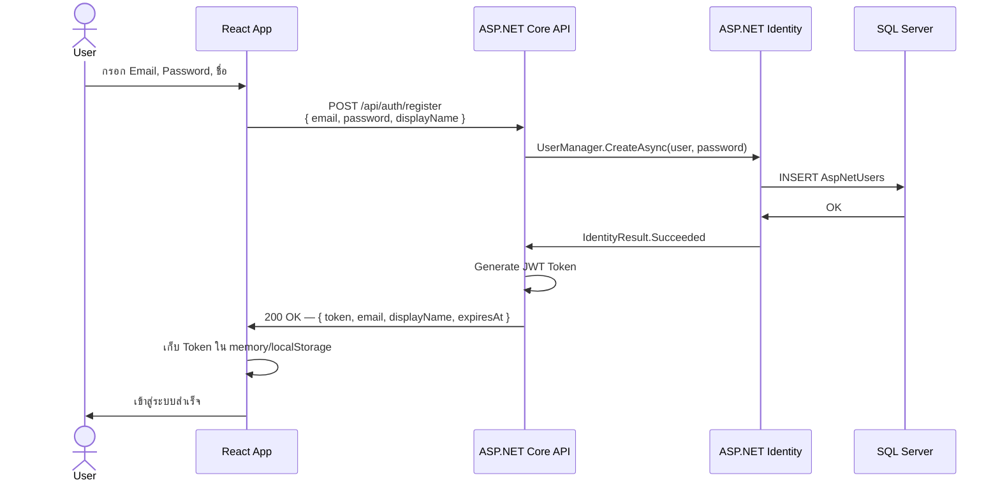
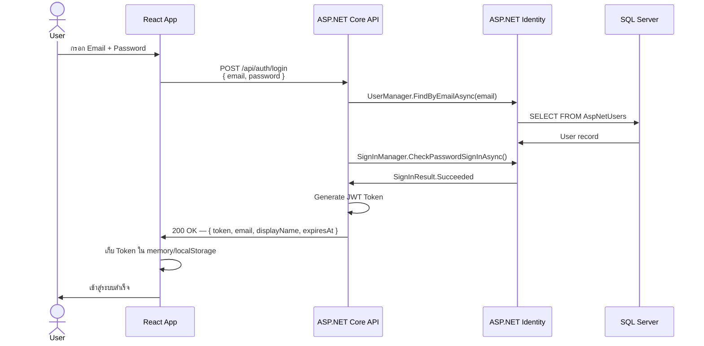
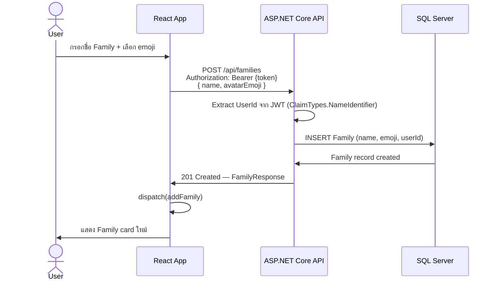
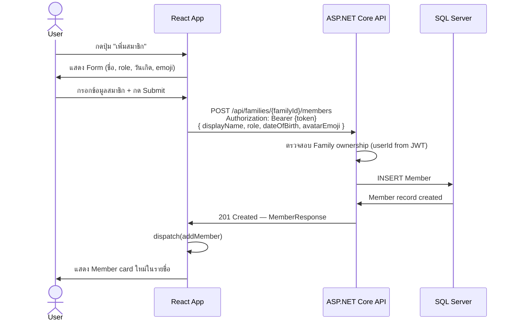
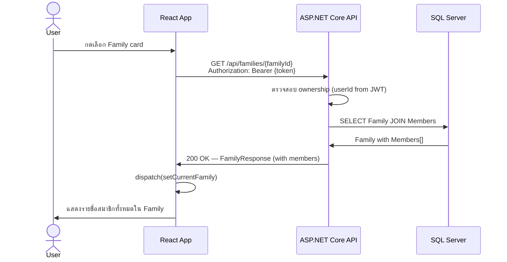
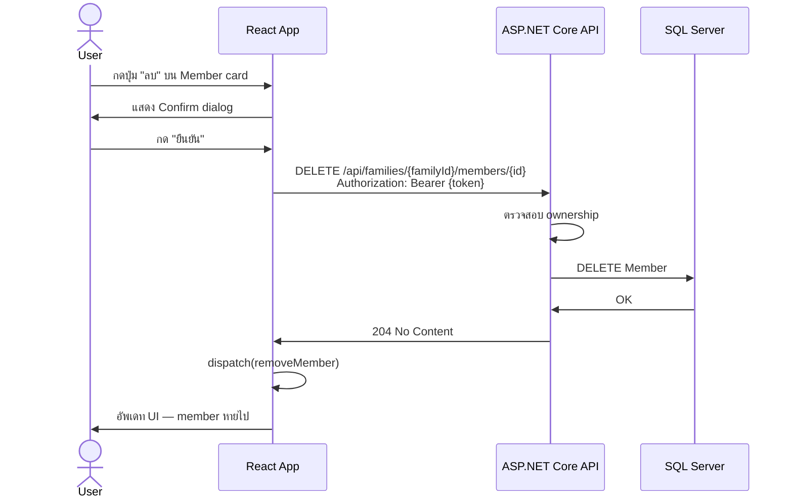

# Sequence Diagrams — Member System

## 1. Register Flow (ASP.NET Identity)

## 2. Login Flow

## 3. Create Family Flow

## 4. Add Member to Family Flow

## 5. View Family Members Flow

## 6. Delete Member Flow

